# Memory Pager — ERD

> 대상 DBMS: MySQL 8 / `utf8mb4_0900_ai_ci`
> 근거: [SPEC.md](SPEC.md) · 범위 밖 기능은 [BACKLOG.md](BACKLOG.md)
> 문서 버전 v0.3 — 그룹 정원 2명, 인증 수단 분리, **펫 활동 / 그림 일기 / 그림체 모델** 재설계 반영

## 1. 다이어그램

```mermaid
erDiagram
    users ||--o{ auth_identities : "인증 수단"
    users ||--o{ devices : "기기 등록"
    users ||--o{ group_members : "소속"
    groups ||--o{ group_members : "구성원 (정원 2)"
    groups ||--|| pets : "그룹당 1마리"
    groups ||--o{ doodles : "그룹 낙서"
    users ||--o{ doodles : "보낸이"
    doodles ||--o{ doodles : "답장"
    doodles ||--o{ doodle_receipts : "확인 기록"
    users ||--o{ doodle_receipts : "확인자"
    groups ||--o{ pokes : "찌르기"
    pets ||--o{ pet_likes : "받은 좋아요"
    users ||--o{ pet_likes : "누른 사람"
    pets ||--o{ pet_activities : "펫의 하루"
    pet_diaries ||--o{ pet_activities : "하루치 활동 묶음"
    pets ||--o{ pet_diaries : "그림 일기장"
    style_models ||--o{ pet_diaries : "어떤 그림체로 그렸나"
    groups ||--o{ style_models : "기본 프리셋 + 학습 모델"
    pets ||--o{ pet_items : "보유 아이템"
    items ||--o{ pet_items : "카탈로그"
    groups ||--o{ monthly_reports : "월간 집계"
    doodles ||--o| monthly_reports : "최고의 낙서"

    users {
        bigint id PK
        varchar display_name "온보딩에서 입력"
        datetime created_at
        datetime updated_at
    }

    auth_identities {
        bigint id PK
        bigint user_id FK
        enum provider "device, kakao, google, apple"
        varchar provider_uid "provider 내 고유 식별자"
        char secret_hash "device 토큰 해시, 소셜은 null"
        datetime created_at
    }

    devices {
        bigint id PK
        bigint user_id FK
        varchar fcm_token "Android 단일 타깃"
        varchar app_version
        datetime last_active_at
    }

    groups {
        bigint id PK
        varchar name
        char invite_code "생성 시 자동 발급, UNIQUE"
        char background_color "hex, 기본 FFFFFF"
        bigint owner_user_id FK
        tinyint member_count "정원 2 강제용"
        datetime created_at
    }

    group_members {
        bigint id PK
        bigint group_id FK
        bigint user_id FK
        varchar nickname "상대가 지어준 별명"
        enum role "owner, member"
        datetime joined_at
    }

    pets {
        bigint id PK
        bigint group_id FK "UNIQUE, 그룹당 1마리"
        varchar name
        int level
        int exp
        int coins "스토어 구매용 잔액"
        bool is_public "다른 그룹 구경 허용"
        datetime created_at
    }

    doodles {
        bigint id PK
        bigint group_id FK
        bigint sender_id FK
        bigint parent_id FK "답장 대상, nullable"
        enum mode "normal, ephemeral"
        enum content_type "photo, drawing, text"
        varchar photo_url "nullable"
        varchar drawing_url "nullable"
        json stroke_data "펜 종류 색상 좌표 획별 타임스탬프"
        text text_body "nullable"
        datetime expires_at "ephemeral 전용"
        datetime created_at
        datetime deleted_at "soft delete"
    }

    doodle_receipts {
        bigint id PK
        bigint doodle_id FK
        bigint user_id FK
        datetime viewed_at "최초 확인 시각"
    }

    pokes {
        bigint id PK
        bigint group_id FK
        bigint from_user_id FK
        bigint to_user_id FK
        datetime created_at
    }

    pet_likes {
        bigint id PK
        bigint pet_id FK
        bigint user_id FK
        datetime created_at
    }

    pet_activities {
        bigint id PK
        bigint pet_id FK
        bigint diary_id FK "하루가 끝나면 일기에 묶임, nullable"
        enum activity "eating, sleeping, walking, playing, drawing, waiting"
        varchar utterance "쓰다듬으면 하는 말, LLM 생성"
        varchar model "생성한 LLM 식별자"
        datetime started_at
        datetime ended_at "nullable, 진행 중이면 null"
    }

    pet_diaries {
        bigint id PK
        bigint pet_id FK
        bigint style_model_id FK "그린 화풍"
        date entry_date
        varchar image_url "SD 생성"
        varchar caption "LLM 생성"
        datetime created_at
    }

    style_models {
        bigint id PK
        bigint group_id FK
        enum kind "default, learned"
        int version "default는 0"
        enum status "pending, training, ready, failed"
        varchar weights_path "프리셋 경로 또는 LoRA 가중치"
        int trained_sample_count
        datetime trained_at "default는 null"
    }

    items {
        bigint id PK
        enum category "clothes, hat, accessory, furniture, background, prop"
        varchar name
        int price_coins
        varchar asset_url
    }

    pet_items {
        bigint id PK
        bigint pet_id FK
        bigint item_id FK
        bool is_equipped
        smallint pos_x "집 꾸미기 배치"
        smallint pos_y
        datetime acquired_at
    }

    monthly_reports {
        bigint id PK
        bigint group_id FK
        char report_month "YYYY-MM"
        int photo_count
        int drawing_count
        int text_count
        int poke_count
        enum dominant_type "photo, drawing, text"
        bigint best_doodle_id FK "nullable"
        enum best_doodle_rule "most_replies, most_strokes, latest"
        int pet_level_start
        int pet_level_end
        datetime generated_at
    }
```

## 2. 설계 결정

**그룹 정원은 2명이다.** 커플이 메인 타깃이므로 `group_members`는 그룹당 최대 2행이다. MySQL은 "자식 행 2개 이하"를 선언적으로 막지 못하므로 ① `groups.member_count`를 두고 ② 가입 트랜잭션을 `SELECT ... FOR UPDATE`로 잠그고 ③ `group_members`에 `BEFORE INSERT` 트리거를 걸어 3번째 행을 거부한다. 세 겹을 다 두는 이유는 초대 코드를 두 사람이 동시에 입력하는 경합이 실제로 발생하기 때문이다.

**별명은 `group_members.nickname` 한 컬럼이면 충분하다.** 2인 그룹에서 "내가 상대에게 지어준 별명"과 "그룹 내 이 사람의 별명"은 같은 값이다. 정원이 2로 고정되었으므로 (그룹, 부르는이, 불리는이) 3중키 테이블의 복잡도를 지불하지 않는다.

**인증 수단을 `auth_identities`로 분리한 것이 이 ERD에서 가장 중요한 결정이다.** `users`는 "사람"이고 절대 바뀌지 않는다. 지금은 `provider='device'` 행 하나만 붙지만, 나중에 카카오 로그인을 추가할 때 **같은 `user_id`에 `provider='kakao'` 행을 하나 더 붙이면** 기존 그룹·낙서·펫이 전부 따라온다. 익명 토큰을 `users`에 직접 박아뒀다면 그 시점에 데이터 마이그레이션이 필요했을 것이다.

**`pet_activities`가 펫 시스템의 중심이다.** 펫은 스스로 하루를 산다 — 밥을 먹고, 잠을 자고, 산책한다. 스케줄러가 하루 몇 차례 LLM으로 다음 활동과 대사를 만들어 이 테이블에 넣는다.

- **`activity`는 자유 문자열이 아니라 열거값이다.** 이 값으로 그림 생성 프롬프트를 조립해야 하기 때문이다. LLM이 "우주를 유영함" 같은 걸 뱉으면 SD 프롬프트를 만들 수 없다.
- **쓰다듬기(PT-1)는 LLM을 부르지 않는다.** `ended_at IS NULL`인 현재 활동 행의 `utterance`를 그대로 돌려준다. 사용자가 연타할 수 있는 인터랙션이라 매 탭마다 추론을 돌리면 3090이 버티지 못한다. 즉 **이 테이블 자체가 캐시다.**
- `model` 컬럼은 나중에 LLM을 바꿨을 때 어떤 대사가 어느 모델 산출물인지 구분하려고 둔다.

**`pet_diaries`는 하루치 활동을 그림 한 장으로 묶는다.** 자정에 그날의 `pet_activities`를 모아 캡션(LLM)과 그림(SD)을 만들고, 활동 행들의 `diary_id`를 채워 묶는다. `UNIQUE(pet_id, entry_date)`로 하루 한 장을 보장한다.

**`style_models`는 기본 프리셋과 학습 모델을 같은 테이블에 담는다.** 그룹 생성 시 `kind='default', version=0, status='ready'` 행을 미리 넣으므로 **가입 첫날부터 일기가 그려진다.** 손그림이 20장 이상 쌓이면 `kind='learned', version=1`로 LoRA 학습을 돌리고, `ready`가 된 이후의 일기만 새 그림체로 그린다. 과거 일기는 다시 그리지 않는다.

이 설계의 핵심은 `pet_diaries.style_model_id`다. 각 일기가 어느 화풍으로 그려졌는지 남으므로, **일기장을 넘기다 보면 그림체가 바뀌는 날이 나온다.** "펫이 우리 그림체를 배웠다"가 화면으로 증명된다. 기본 그림체가 없었다면 첫날의 일기장은 빈 화면이었을 것이고, 7일 안에 LoRA 학습 데이터가 쌓이지 않아 시연에서 일기장을 아예 못 보여줬을 것이다.

**사라지기 모드는 `doodle_receipts` + `doodles.expires_at` 조합이다.** 수신자가 처음 확인하면 `viewed_at`이 찍히고 서버가 `expires_at = viewed_at + 5s`를 세팅한다. 만료 시 `deleted_at`을 채우고 미디어 파일을 실제 삭제한 뒤 `doodle:expired`를 브로드캐스트한다. 앱이 중간에 죽어도 스케줄러의 만료 스윕이 정리한다.

**낙서 유형은 저장 시점에 확정한다.** `content_type`은 전송 시 앱이 무엇을 담았는지 알고 있으므로 그때 판정해 컬럼에 박는다. 유형 표시(RV-3)와 월간 유형 분포(MR-4)가 이 컬럼 하나로 해결된다.

**`stroke_data`에 획별 타임스탬프를 함께 저장한다.** 원래는 펜 종류·색상·좌표만 담을 계획이었으나, "이번 달 최고의 낙서"(MR-3)를 규칙 기반으로 고를 때 쓸 신호가 너무 빈약하다는 것이 드러났다. 2인 그룹에서 스키마가 주는 견고한 행동 신호는 **답장 수 하나뿐**이다 — `doodle_receipts`는 최초 확인만 기록하므로 체류 시간이 없고, 낙서에 다는 하트도 없다. 타임스탬프가 있으면 **그리기 소요 시간**이라는 훨씬 나은 대리 지표가 생기는데, 캔버스가 이미 좌표를 찍고 있으므로 비용이 사실상 없다.

> 주의할 것 두 가지. 첫째, `stroke_data`에서 뽑은 지표(획 수, 색 수, 소요 시간)는 전부 **정성이 아니라 활동량**을 재며 왕복 낙서나 색 순환으로 조작할 수 있다. 결정론적 보조 신호로만 쓴다. 둘째, 커버리지를 잰다면 **bounding box 면적비를 쓰면 안 된다** — 대각선 획 하나로 100%가 나온다. 점유 그리드셀 비율이나 convex hull 면적을 써야 한다.

**월간 레포트는 스냅샷 테이블이다.** ① 사라지기 모드 낙서는 삭제되어 사후 집계가 불가능하고 ② 월말 푸시 시점에 값이 고정되어야 하므로 계산 결과를 저장한다. `best_doodle_rule`은 최고의 낙서를 어떤 규칙으로 골랐는지 남긴다 — 나중에 vision 모델을 도입하면 규칙이 바뀌므로, 과거 레포트가 어떤 기준이었는지 알 수 있어야 한다.

**코인은 `pets.coins` 잔액만 둔다.** 기능정의서의 "펫 스토어 — 아이템 판매"가 통화를 전제하므로 잔액은 필요하다. 획득 규칙과 원장(ledger)은 기획 문서에만 있으므로 [BACKLOG.md](BACKLOG.md)로 뺐다.

## 3. 인덱스 · 제약

| 테이블 | 제약 |
|---|---|
| `auth_identities` | `UNIQUE(provider, provider_uid)`, `UNIQUE(user_id, provider)` |
| `groups` | `UNIQUE(invite_code)`, `CHECK(member_count <= 2)` |
| `group_members` | `UNIQUE(group_id, user_id)`, `INDEX(user_id)`, 정원 트리거 |
| `pets` | `UNIQUE(group_id)` — 그룹당 1마리 |
| `doodles` | `INDEX(group_id, created_at DESC)` — 사진첩 날짜 정렬 `INDEX(group_id, content_type)` — 유형 필터·LoRA 학습 대상 조회 `INDEX(parent_id)` — 최고의 낙서 선정(답장 수) `INDEX(expires_at)` — 만료 스윕 |
| `doodle_receipts` | `UNIQUE(doodle_id, user_id)` — 최초 확인 1회만 |
| `pet_likes` | `UNIQUE(pet_id, user_id)` — 중복 좋아요 방지 |
| `pet_activities` | `INDEX(pet_id, ended_at)` — 현재 활동 조회 `INDEX(diary_id)` |
| `pet_diaries` | `UNIQUE(pet_id, entry_date)` — 하루 한 장 |
| `style_models` | `UNIQUE(group_id, version)` |
| `pet_items` | `UNIQUE(pet_id, item_id)` |
| `monthly_reports` | `UNIQUE(group_id, report_month)` |

`report_month`는 `YEAR`·`MONTH` 함수명과 헷갈리는 `year_month` 대신 쓴 이름이다.

## 4. 다음 단계

`backend/schema.sql`(DDL)과 SQLAlchemy 모델을 생성한다. SPEC 7절의 미해결 사항 중 ①(정원 강제 방식)과 ④(LoRA 학습 임계값)만 이 ERD에 닿으며, 나머지는 스키마를 바꾸지 않는다.
